# OCR

목표 : python과 Google Vision API를 이용하여 아래 그림과 같이

스캔 혹은 스크린샷 되어 있는 그림 안에 글자를 우리가 편집할 수 있는 텍스트로 변환

image

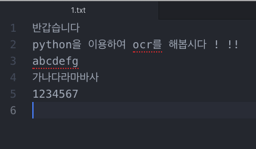

txt

## 준비물

python3, 구글 계정, 해외 결제가 되는 카드(신용카드 또는 체크카드), 스캔할 대상 파일

## 1. Google Cloud Platform 가입

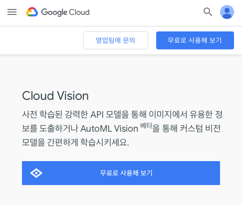

- [Google Vision API](https://cloud.google.com/vision/?hl=ko) 접속 후 무료로 사용해보기 버튼 클릭

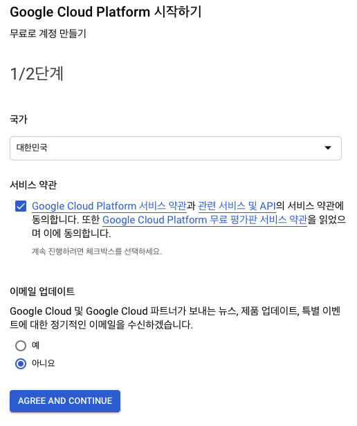

- 서비스 약관 및 이메일로 정보 수신 여부 선택 후 AGREE AND CONTINUE 버튼 클릭

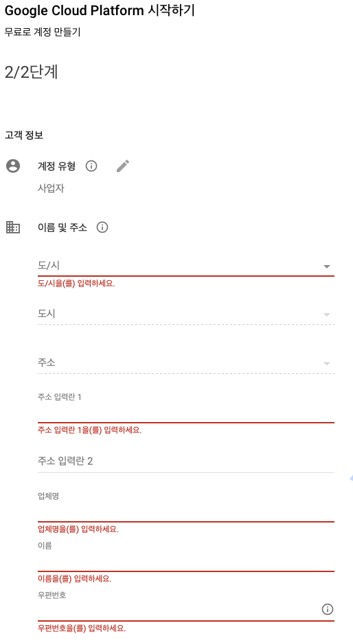

- 고객 정보에 빨간 줄을 필수 값으로 입력 후 가입
- 결제 수단인 카드 정보도 입력해야 함

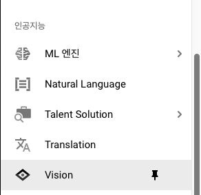

- 가입이 완료 되었으면 Google Cloude Platform의 왼쪽메뉴에서 인공지능 > Vision 클릭

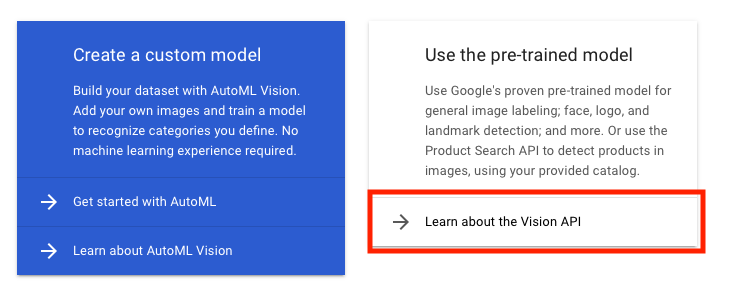

- Use the pre-trained model의 Learn about the Vision API 클릭

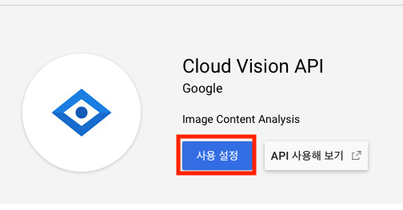

- 사용설정 버튼 클릭

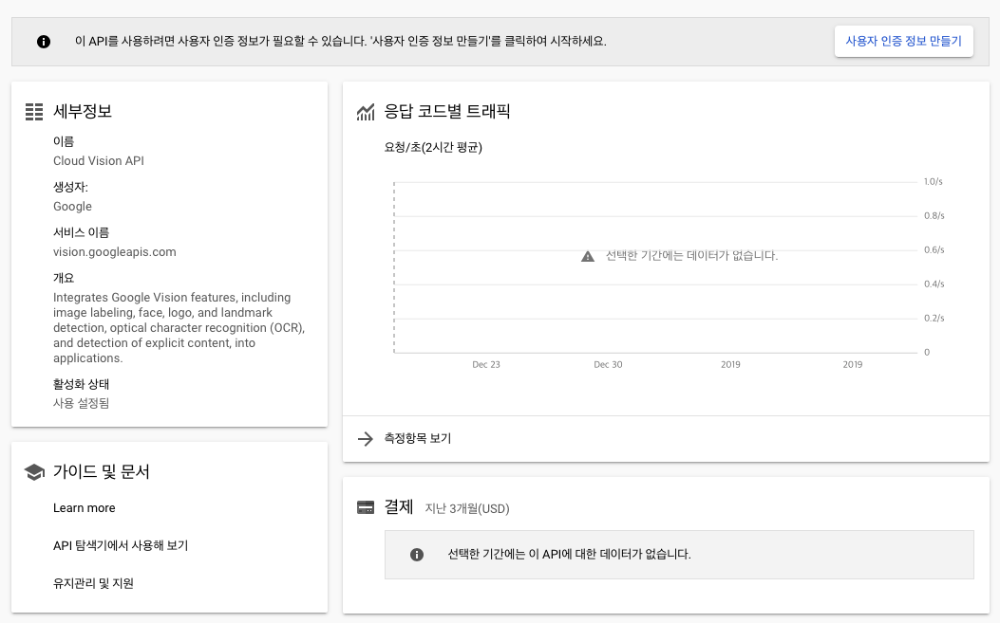

- 사용자 인증 정보 만들기 클릭

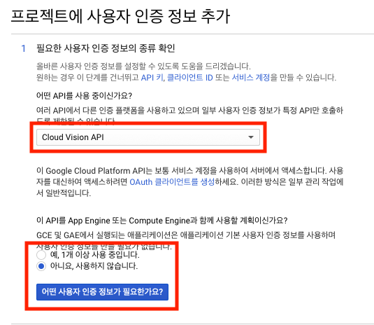

- Cloud Vision API, 아니요 선택 후 '어떤 사용자 인증 정보가 필요한가요?' 버튼 클릭

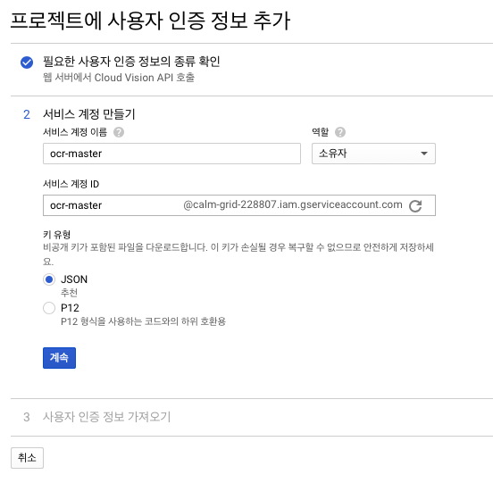

- 서비스 계정 이름 및 ID 입력, JSON 선택 후 계속 클릭

JSON 파일 다운 완료가 되면 준비물 완성 !!!!

## 폴더 구조

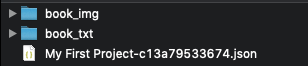

- 파이썬 루트 폴더 아래에 아래 그림과 같이 book_img, book_txt 폴더와 인증정보가 담겨있는 JSON 파일을 같이 넣는다.

## Google Vision API 사용자 인증

위 폴더 위치에서 Terminal 실행 후

    export GOOGLE_APPLICATION_CREDENTIALS="인증파일 JSON 위치"
    예)
    export GOOGLE_APPLICATION_CREDENTIALS="./My First Project-c13a79533674.json"

이후 jupyter notebook 실행

## 파이썬 코드

- 필요한 모듈 불러오기

    import io # 파일을 읽고 쓰기위한 모듈
    import os # os의 기능을 사용하기 위한 모듈

    # Imports the Google Cloud client library
    from google.cloud import vision
    from google.cloud.vision import types

- 필요 변수 설정

    client = vision.ImageAnnotatorClient()
    filenames = os.listdir('./book_img') # book_img 아래에 있는 이미지 파일 이름을 불러오기

- book_img 아래의 파일을 읽은 후 같은 이름의 txt 포맷으로 book_txt에 저장

    for filename in filenames:
        path = os.path.join('./book_img', filename)

        # Loads the image into memory
        with io.open(path, 'rb') as image_file:
            content = image_file.read()

        image = vision.types.Image(content=content)
        response = client.text_detection(image=image)
        texts = response.text_annotations

        with open('./book_txt/'+filename[0:-4]+'.txt', "w") as f:
            f.write(texts[0].description)

## 결과 화면

image

txt

위와 같은 방법으로 스캔 되어 있는 600page를 한번에 OCR를 해보았는데 생각보다 인식률이 좋게 나와 공유하는 차원에 포스팅을 해보았다.

이를 이용하면 학생인 경우 참고서를 OCR하여 자신만의 요약집을 만들때 유용할거 같고, 아니면 집 한켠에 쌓아두고 있는 책들을 이북으로 만들때 유용하게 이용이 될수 있을 거 같다.

하지만 이 Google Vision API에도 문제점이 몇가지가 있는데,

1. 사용자가 쓴 손글씨의 인식률이 너무 낮다.
2. '책이'라는 단어를 OCR를 하면 '이'가 숫자 0, 1로 인식되는 경우가 있다.

위와 같은 문제점으로 OCR를 한후에 후처리 과정이 필수로 보이는데 그래도 전부 타이핑하는 시간을 획기적으로 줄일수 있는 방법으로 보인다.
